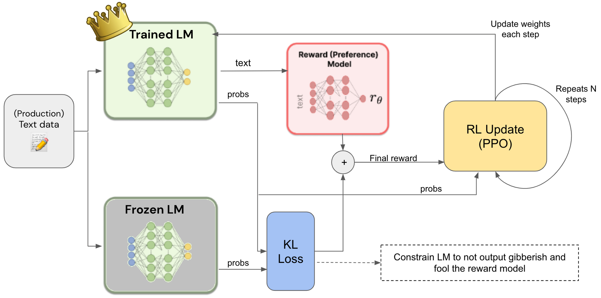
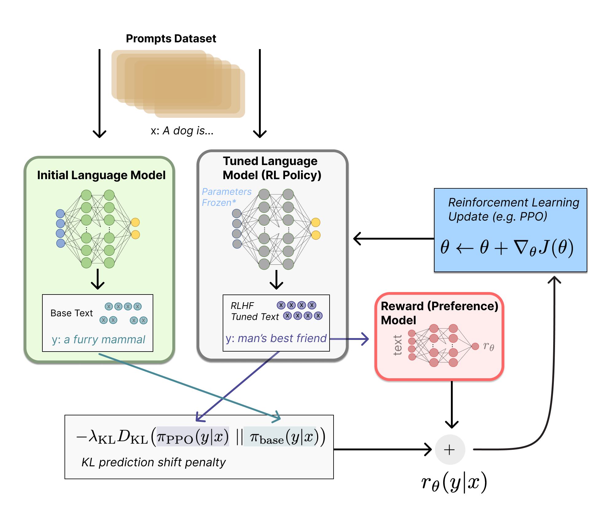

# RLHF PPO Theory Walkthrough

A single-file, runnable educational implementation of **LLM post-training with RLHF-style PPO**.

This repository is intended to make the **training-time data flow** of PPO-based RLHF explicit and inspectable. It does **not** attempt to reproduce production-scale language model training systems. Instead, it provides a compact, self-contained script that exposes the core mechanics of:

* supervised warm start
* frozen reference policy
* reward modeling
* rollout collection
* token-level KL reward shaping
* generalized advantage estimation (GAE)
* PPO policy/value updates
* adaptive KL control
* the separation between training-time components and deployment-time inference

---





Modern large language models are usually developed in multiple stages:

1. **Pretraining**
   A base model is trained with next-token prediction on large-scale corpora to acquire general linguistic and world knowledge.

2. **Supervised Fine-Tuning (SFT)**
   The pretrained model is adapted to instruction following, response formatting, and domain-specific tasks using curated prompt-response pairs.

3. **Post-Training / Alignment**
   The SFT model is further optimized to better match preference, helpfulness, harmlessness, style, or task-specific objectives.

This repository focuses on the **post-training** stage, specifically on **Reinforcement Learning from Human Feedback (RLHF)** using **Proximal Policy Optimization (PPO)**.

---

## RLHF in Brief

RLHF is a framework in which a language model is optimized using a reward signal that approximates human preference.

A typical PPO-based RLHF setup contains four components:

* **Policy model** (`π_θ`)
  The model being optimized and, after training, the model used for deployment.

* **Reference model** (`π_ref`)
  A frozen copy of the SFT policy, used to constrain excessive policy drift through KL regularization.

* **Reward model (RM)** (`r(x, y)`)
  A model or scoring function that evaluates the quality of a generated response.

* **Value model / Critic** (`V(s)`)
  A model that estimates the expected future return of each generation state and reduces variance during policy optimization.

The central idea is straightforward:

1. sample responses from the current policy
2. score them with a reward signal
3. assign token-level credit using value estimates and GAE
4. update the policy with PPO under a KL constraint relative to the reference model

---

## Why PPO for RLHF?

PPO has historically been one of the most widely used policy optimization methods in RLHF because it offers a relatively stable and practical first-order update rule.

Its main advantages include:

* **clipped policy updates** that reduce destructive step sizes
* **compatibility with sequence-level rewards** and token-level credit assignment
* **integration with value-function baselines** for lower-variance training
* **practical on-policy optimization** with minibatch updates over rollout data

In LLM alignment, PPO is not the only option, and newer approaches such as DPO, IPO, and related preference-optimization methods are often simpler. However, PPO remains important because it explicitly exposes the full reinforcement learning pipeline: rollout, reward shaping, value estimation, advantage computation, and constrained policy updates.

---

## What This Repository Implements

This repository provides a small, fully readable training script that mirrors the logical structure of PPO-based RLHF.

The implementation includes:

* a **toy causal language model with a value head**
* a brief **SFT warm start** phase
* a **frozen reference model** copied from the SFT policy
* a **frozen reward function** used to score completed responses
* **autoregressive rollout generation** with storage of old log-probabilities and value estimates
* **token-level KL penalties** computed against the reference model
* **sequence-level reward injection** on the last valid response token
* **GAE-based advantage estimation** and return computation
* **PPO clipped objective** for actor updates
* **value loss** for critic updates
* **entropy regularization**
* **adaptive KL coefficient adjustment**

The goal is educational clarity rather than scale.

---

## PPO-Based RLHF Training Flow

### 1. Supervised Warm Start

Training starts from a policy that has already learned a reasonable response prior through supervised fine-tuning. In practical RLHF systems, PPO is rarely started from a randomly initialized policy.

In this demo, a short SFT stage is included to simulate that warm-start behavior.

### 2. Freeze the Reference Model

A copy of the post-SFT policy is frozen as the **reference model**. During PPO, the policy is discouraged from drifting too far from this reference through a KL-based penalty.

### 3. Rollout Collection

For a batch of prompts, the current policy autoregressively samples response tokens. During rollout, the script records:

* generated response tokens
* old policy log-probabilities for sampled tokens
* value predictions for each generation step
* validity masks for response tokens

This stage is **forward-only** and does not update model parameters.

### 4. Reward Construction

After rollout, two reward-related quantities are computed:

* a **sequence-level reward** from the reward model
* a **token-level KL penalty** relative to the reference model

A common practical construction is:

* each token receives a KL-based shaping reward
* the final valid token additionally receives the sequence-level reward from the reward model

This produces a **token-level reward sequence** suitable for temporal credit assignment.

### 5. Advantage and Return Computation

Using the token-level rewards and stored value predictions, the script computes:

* **TD residuals**
* **generalized advantage estimates (GAE)**
* **returns** used for critic regression

This is the stage where delayed sequence-level reward is propagated backward across the generated trajectory.

### 6. PPO Update

During the update phase, the model does **not** resample new responses. Instead, it performs a **teacher-forced forward pass** over the already collected responses to recompute:

* current policy log-probabilities
* current value estimates
* token entropies

Then it applies:

* PPO clipped actor loss
* critic value loss
* entropy bonus

Only the **policy/value model** is optimized. The **reference model** and **reward model** remain frozen.

### 7. Repeat Rollout → Update

Because PPO is an **on-policy** algorithm, rollout data are only reused for a limited number of optimization epochs. After that, a new rollout batch must be collected from the updated policy.

---

## Key Quantities in PPO-Based RLHF

For a prompt `x` and autoregressive response `y = (y1, y2, ..., yT)`, define the state at time step `t` as `s_t = (x, y_{<t})`, and the sampled action as `a_t = y_t`.

Important quantities include:

* **old policy log-probability**
  `log π_old(a_t | s_t)`
  Recorded during rollout.

* **current policy log-probability**
  `log π_θ(a_t | s_t)`
  Recomputed during the update phase.

* **reference policy log-probability**
  `log π_ref(a_t | s_t)`
  Used for KL regularization.

* **value estimate**
  `V(s_t)`
  Produced by the critic / value head.

* **token-level KL proxy**
  A common practical choice is:

  `kl_t = log π_old(a_t | s_t) - log π_ref(a_t | s_t)`

* **KL shaping reward**
  `r_t^KL = -β * kl_t`

* **sequence-level reward**
  `r_rm(x, y)`

* **final token-level reward**
  In a common RLHF construction:

  * for intermediate tokens: reward is primarily KL shaping
  * for the last valid token: reward includes both KL shaping and the sequence-level RM score

* **GAE advantage**
  `A_t`

* **return**
  `G_t = A_t + V(s_t)`

* **PPO ratio**
  `ratio_t = exp(log π_θ(a_t | s_t) - log π_old(a_t | s_t))`

This distinction between **old**, **current**, and **reference** probabilities is central to understanding PPO-based RLHF correctly.

---

## Training-Time Components vs Deployment-Time Components

One of the most important conceptual distinctions in RLHF is the difference between **training-time scaffolding** and **deployment-time inference**.

### Training time

PPO-based RLHF typically requires:

* policy model
* reference model
* reward model
* value model / critic
* rollout storage
* GAE and PPO loss computation

### Deployment time

After training, inference usually requires only:

* the **final policy model**

The reward model, reference model, critic, and PPO losses are not part of standard online generation.

---

## Implementation Notes

This repository intentionally uses a minimal toy setup so that the full PPO-RLHF logic can be examined in one place.

It is therefore **not** intended as:

* a benchmark implementation
* a distributed training framework
* a large-scale LLM serving stack
* a production RLHF system

Several simplifications are deliberate:

* a small recurrent language model is used instead of a Transformer
* the reward model is implemented as a frozen rule-based scorer rather than a learned neural preference model
* rollout is performed without KV-cache optimization
* the objective is pedagogical readability rather than throughput

Despite those simplifications, the core post-training logic remains faithful to PPO-style RLHF:

* collect on-policy rollouts
* compute reward and KL shaping
* estimate advantages and returns
* update policy and value under a clipped objective

---

## File Structure

* `rlhf_ppo_toy_full_walkthrough.py`
  Single-file runnable implementation of the entire training flow.

---

## Running the Demo

Requirements:

* Python 3.10+
* PyTorch 2.x

Run:

```bash
python rlhf_ppo_toy_full_walkthrough.py
```

The script prints training logs showing quantities such as:

* rollout length
* reward model score
* token-level KL
* total shaped reward
* actor loss
* critic loss
* entropy
* approximate KL
* clip fraction
* adaptive KL coefficient

It also prints sample generations before SFT, after SFT, and during PPO training.

---

## What to Look For When Reading the Code

The most important functions in the script are:

* `generate_rollout`
  Collects autoregressive samples and stores rollout-time quantities.

* `compute_ref_logprobs`
  Computes reference log-probabilities for sampled tokens.

* `build_token_level_rewards`
  Combines KL shaping and sequence-level reward into per-token rewards.

* `compute_gae_and_returns`
  Performs temporal credit assignment.

* `ppo_update`
  Recomputes current-policy log-probabilities and applies PPO/value updates.

* `train_rlhf_ppo`
  Orchestrates the complete training loop.

---

## Common Practical Lessons Reflected in the Demo

Even in a toy implementation, several practical lessons from real PPO-RLHF systems remain visible:

* PPO should generally start from a reasonable **SFT warm start**.
* The **reference model** should remain frozen.
* **Old log-probabilities** must come from the rollout policy snapshot, not from a later recomputation after parameters have changed.
* PPO updates should apply only to **valid response tokens**, not to prompt tokens or padded positions.
* The policy update is based on **teacher-forced evaluation of collected responses**, not on resampling during the optimization step.
* **KL control** is often critical for preventing unstable policy drift.
* The **critic** is not optional bookkeeping; poor value estimates can substantially destabilize policy optimization.
* PPO data are **on-policy** and cannot be reused indefinitely.

---

## Limitations

This repository does not cover many engineering concerns found in large-scale LLM post-training, including:

* distributed rollout and optimization
* mixed precision and memory optimization
* packed sequences and dynamic batching
* KV cache acceleration during generation
* learned reward-model training from preference pairs
* large-vocabulary tokenizers and real instruction datasets
* large-scale monitoring, evaluation, and safety filtering

Those are essential for production systems, but they are separate from the core conceptual structure that this repository aims to clarify.

---

## Intended Use

This repository is intended for:

* readers learning the mechanics of PPO-based RLHF
* engineers who want a minimal end-to-end post-training reference
* interview preparation on RLHF and PPO data flow
* debugging conceptual confusion around rollout, reward shaping, GAE, and policy/value updates

It is best understood as a **didactic implementation** rather than a scalable framework.

---

## Summary

This project presents a compact walkthrough of **LLM post-training with RLHF-style PPO**. Its purpose is to expose the full reinforcement learning pipeline behind alignment-oriented post-training:

* start from an SFT policy
* sample on-policy responses
* score them with reward and KL shaping
* propagate sequence-level reward backward with GAE
* update the policy with PPO and the critic with value regression
* deploy only the final aligned policy

For readers who want to understand not only the formulas but also the concrete training-time flow of PPO-based RLHF, this repository provides a minimal but complete reference.


## Additional part

# RLHF PPO Walkthrough — Advanced Engineering Version

A practical, systems-oriented guide to **LLM post-training with RLHF and PPO**, extended from the toy educational demo toward a more realistic engineering stack built around **OpenRLHF**, **vLLM**, and **DeepSpeed**.

This document is intended for readers who already understand the basic PPO-RLHF loop and want to connect that conceptual pipeline to the components commonly used in real-world large-model post-training systems.

---

## Scope

This repository contains a compact educational PPO-RLHF demo. The original implementation is deliberately small and self-contained so that the logic of rollout, reward shaping, GAE, and PPO updates can be inspected directly.

This advanced document explains how that same logic maps onto a more practical large-model training stack:

* **OpenRLHF** for RLHF training orchestration
* **vLLM** for high-throughput rollout generation
* **DeepSpeed** for large-scale distributed optimization and memory efficiency

The goal is not to claim feature completeness or production readiness. The goal is to bridge the gap between a didactic implementation and the engineering structure typically required for post-training modern LLMs.

---

## LLM Post-Training in Practice

A modern LLM training pipeline is typically separated into three broad phases:

1. **Pretraining**
   The model learns a general next-token prediction prior from large-scale corpora.

2. **Supervised Fine-Tuning (SFT)**
   The model is adapted toward instruction-following behavior, response formatting, domain adaptation, and initial alignment.

3. **Post-Training / Alignment**
   The SFT policy is further optimized against preference, quality, style, safety, or task-level objectives.

RLHF belongs to the third stage. In PPO-based RLHF, the model is no longer optimized only to imitate target text. Instead, it is optimized to maximize a reward signal under constraints that keep behavior stable and prevent destructive policy drift.

---

## Why an Advanced Stack Is Needed

A toy PPO script is sufficient to explain the mathematics and the training-time data flow. It is not sufficient to train a large instruction model efficiently.

Once the policy becomes large, the dominant engineering problems change:

* rollout generation becomes a major throughput bottleneck
* storing and recomputing log-probabilities becomes expensive
* policy, critic, reward, and reference models compete for GPU memory
* on-policy training requires frequent rollout-refresh cycles
* sequence padding, packing, truncation, and response filtering materially affect efficiency
* optimizer state, gradients, and activations must be partitioned to fit large models

This is where OpenRLHF, vLLM, and DeepSpeed become useful.

---

## Core Components in PPO-Based RLHF

A practical PPO-RLHF system still revolves around the same conceptual components as the toy demo.

### Policy / Actor

The model being optimized. This is the model that generates responses during rollout and is updated during PPO.

### Reference Model

A frozen copy of the SFT policy. It is used to compute a KL constraint so that PPO does not push the policy too far away from the supervised prior.

### Reward Model

A model that scores complete prompt-response pairs. In standard RLHF, the reward model is usually trained from pairwise or ranked human preference data.

### Critic / Value Model

A model that estimates expected future return for each generation state. It reduces variance and enables token-level temporal credit assignment through GAE.

### Rollout Engine

A high-throughput inference path used to sample responses from the current policy. In larger systems, this is typically separated from the training graph and optimized aggressively for generation throughput.

---

## Why OpenRLHF?

**OpenRLHF** is useful because it packages the training orchestration logic required for RLHF-style optimization around large language models.

In practical terms, it helps organize:

* actor / reference / reward / critic roles
* rollout collection
* reward computation
* PPO minibatch updates
* distributed training setup
* model checkpointing and training control

The conceptual PPO loop remains the same, but OpenRLHF reduces the amount of custom glue code needed to connect the different stages into a workable post-training pipeline.

For educational purposes, the toy script in this repository exposes the full logic explicitly. For larger-scale experiments, a framework such as OpenRLHF is more appropriate because the orchestration burden quickly becomes nontrivial.

---

## Why vLLM?

In PPO-based RLHF, rollout generation is not a minor detail. It is often one of the dominant system bottlenecks.

A naive training implementation may generate responses with the same PyTorch model used for training. This is conceptually simple but inefficient. Large-model rollout requires:

* fast autoregressive decoding
* efficient KV-cache handling
* strong batch scheduling
* good GPU utilization during generation

**vLLM** addresses this problem by providing an optimized inference engine for LLM generation. In an RLHF stack, vLLM is typically used to serve or run the **actor for rollout sampling**, significantly increasing sample throughput compared with a naive training-only generation path.

This separation matters because PPO is **on-policy**: the system must repeatedly alternate between rollout collection and policy updates. If rollout is slow, the entire training loop slows down.

---

## Why DeepSpeed?

PPO training for large LLMs is memory-intensive even before reward models and rollout engines are considered.

A realistic post-training stack must manage:

* model weights
* gradients
* optimizer states
* activations
* multiple model copies or role variants
* long sequence lengths
* minibatch accumulation

**DeepSpeed** is commonly used to make this tractable through distributed optimization and memory partitioning.

Typical benefits include:

* larger trainable model capacity per device
* reduced optimizer-state pressure
* gradient accumulation support for effective batch scaling
* distributed execution across multiple GPUs or nodes
* compatibility with large-model fine-tuning workflows

In practice, DeepSpeed is usually responsible for the **training side**, while vLLM is responsible for the **high-throughput inference side**.

---

## Conceptual Mapping: Toy Demo → Practical RLHF Stack

The toy implementation in this repository contains the essential PPO-RLHF logic in a single script. A practical stack distributes that logic across specialized systems.

### In the toy demo

* rollout generation is performed directly inside the training script
* the reward function is local and simple
* the reference model is a frozen in-memory copy
* PPO updates are run in a single process with a small model

### In a more realistic stack

* **OpenRLHF** orchestrates the actor / reference / reward / critic workflow
* **vLLM** handles efficient autoregressive rollout generation
* **DeepSpeed** handles distributed actor / critic optimization
* reward modeling and logging become separate operational concerns
* rollout and update may run as distinct stages or services within one training pipeline

The mathematics are the same. The systems architecture is not.

---

## PPO-Based RLHF Data Flow

The advanced stack still follows the same training-time logic.

### 1. Start from an SFT policy

PPO should not begin from a random policy. The usual starting point is an SFT checkpoint that already produces coherent, task-aligned responses.

### 2. Freeze the reference model

A frozen reference is derived from the SFT policy. It is used to compute KL penalties that regularize the actor during PPO.

### 3. Collect rollouts

For a batch of prompts, the actor samples responses autoregressively.

Typical rollout-side quantities include:

* prompt tokens
* sampled response tokens
* old policy log-probabilities for sampled tokens
* response masks
* optional value estimates

In a practical system, this stage is a strong candidate for acceleration via **vLLM**.

### 4. Score responses

Each generated response is evaluated by the reward model, which produces a sequence-level reward.

At the same time, KL-related terms are computed against the reference model. These KL terms are often transformed into token-level shaping rewards.

### 5. Compute token-level rewards

A common PPO-RLHF reward construction uses:

* per-token KL shaping reward
* sequence-level reward added at the final valid token

This yields a dense-enough reward sequence for temporal credit assignment.

### 6. Compute advantages and returns

Using rewards and value estimates, the training pipeline computes:

* TD residuals
* generalized advantage estimates (GAE)
* returns for critic regression

This is where delayed response-level reward is propagated backward over the token trajectory.

### 7. Run PPO updates

The actor does not resample during optimization. Instead, it performs teacher-forced evaluation over the already collected responses to recompute current log-probabilities and current value predictions.

The update stage then applies:

* PPO clipped actor loss
* critic value loss
* optional entropy regularization
* gradient clipping
* distributed optimizer steps

This training side is a strong candidate for **DeepSpeed**.

### 8. Refresh rollout data

Because PPO is on-policy, old rollout data cannot be reused indefinitely. After a limited number of optimization epochs, a new rollout batch must be collected from the updated actor.

---

## Separation of Responsibilities in a Practical Stack

A useful mental model is the following:

### OpenRLHF

Responsible primarily for **RLHF workflow orchestration**:

* actor / critic / reward / reference coordination
* rollout-update loop management
* PPO training logic
* training configuration and execution flow

### vLLM

Responsible primarily for **rollout-side inference efficiency**:

* autoregressive decoding
* KV-cache efficiency
* serving or generation throughput
* batching and scheduling during sampling

### DeepSpeed

Responsible primarily for **training-side scalability and memory efficiency**:

* distributed optimization
* optimizer-state partitioning
* memory reduction
* larger effective model training

These tools solve different problems. Treating them as interchangeable is a conceptual mistake.

---

## Practical Design Pattern

A common engineering pattern for PPO-RLHF looks like this:

1. load or initialize the SFT actor checkpoint
2. freeze a reference copy
3. initialize the critic and load or attach the reward model
4. use **vLLM** or another optimized inference path to generate rollout responses
5. compute rewards and KL shaping
6. assemble rollout batches with masks, old log-probabilities, rewards, and returns
7. update actor and critic with **OpenRLHF + DeepSpeed**
8. periodically refresh the rollout policy and repeat

This separation is often easier to reason about than trying to force one monolithic script to handle both optimized rollout and large-scale distributed training simultaneously.

---

## What Changes Relative to the Toy Demo?

Moving from the toy script to a practical RLHF stack changes the implementation burden in several ways.

### Model scale

The toy script uses a minimal recurrent model for readability. A practical stack typically uses a Transformer-based causal LM with billions of parameters.

### Reward model

The toy script uses a frozen rule-based reward function. Practical RLHF typically uses a learned reward model trained from preference data.

### Rollout throughput

The toy script generates responses directly through the training model. Practical systems usually need a dedicated or optimized inference engine such as vLLM.

### Distributed training

The toy script runs in a simple single-process setting. Practical actor/critic optimization usually requires DeepSpeed or equivalent distributed tooling.

### Monitoring and control

A real RLHF pipeline must track stability metrics such as:

* reward model score
* approximate KL
* clip fraction
* response length distribution
* value loss and value calibration
* reward hacking symptoms
* rollout/update throughput

---

## Important Training-Time Quantities

Even in a more advanced stack, the central PPO quantities remain unchanged.

For prompt `x`, state `s_t = (x, y_{<t})`, and sampled token `a_t = y_t`, the system typically tracks:

* `log π_old(a_t | s_t)`
  rollout-time policy log-probability

* `log π_θ(a_t | s_t)`
  current policy log-probability during update

* `log π_ref(a_t | s_t)`
  reference log-probability

* `V(s_t)`
  critic value estimate

* `A_t`
  advantage estimate from GAE

* `G_t`
  return for critic supervision

* `ratio_t = exp(log π_θ - log π_old)`
  PPO ratio on sampled actions

Confusion between **old policy**, **current policy**, and **reference policy** is one of the most common conceptual mistakes in PPO-based RLHF.

---

## Training-Time Components vs Inference-Time Components

A large practical RLHF stack contains more components than the final deployed model.

### Training time

The training loop may require:

* actor / policy
* critic / value model
* reference model
* reward model
* rollout engine
* rollout buffers
* GAE and PPO loss computation
* distributed optimizer infrastructure

### Deployment time

Standard online inference usually requires only:

* the final actor / policy model

The reward model, reference model, critic, and PPO-specific training logic are normally not part of serving-time generation.

---

## Engineering Considerations

Several practical issues matter once the stack is scaled up.

### 1. Rollout is a systems bottleneck

If rollout generation is slow, PPO becomes expensive regardless of how efficient the backward pass is. This is one reason vLLM is attractive in RLHF workflows.

### 2. PPO is on-policy

Rollout data become stale quickly. Excessive reuse of the same rollout batch can make training effectively off-policy and destabilize optimization.

### 3. KL control is operationally important

If KL is too small, the actor may exploit reward weaknesses or drift into undesirable behavior. If KL is too large, PPO may collapse into near-SFT behavior with little meaningful learning.

### 4. The critic matters

A poor critic increases variance, weakens credit assignment, and can make actor updates unstable even when the PPO objective is implemented correctly.

### 5. Reward quality dominates everything

A weak reward model can easily produce reward hacking, brittle behavior, or optimization toward shallow artifacts. Framework choice does not fix poor reward design.

### 6. Sequence handling affects both quality and efficiency

Padding, truncation, EOS handling, stop-token logic, and prompt/response masking are not cosmetic details. They directly affect reward construction, advantage estimation, and training cost.

---

## Suggested Repository Positioning

For this repository, the most accurate positioning is:

* the existing script is a **conceptual and didactic PPO-RLHF walkthrough**
* this advanced document explains how the same logic maps onto a practical stack using **OpenRLHF + vLLM + DeepSpeed**
* future repository extensions may replace the toy components with framework-based training and large-model infrastructure

This framing is more honest and more useful than presenting the repository as a complete production RLHF framework.

---

## Possible Future Extensions

A natural next step for this repository would be to evolve the educational script into a more realistic post-training sandbox with:

* a learned reward model
* a Transformer-based policy
* OpenRLHF training orchestration
* DeepSpeed-backed actor/critic optimization
* vLLM-backed rollout generation
* real instruction or preference datasets
* experiment tracking and evaluation scripts

That would preserve the pedagogical value of the current demo while moving closer to the workflow used in practical large-model alignment experiments.

---

## Summary

This advanced README reframes the toy PPO-RLHF demo in terms of the engineering realities of large-model post-training.

The central message is simple:

* the **toy script** explains the algorithmic logic
* **OpenRLHF** organizes the RLHF workflow
* **vLLM** accelerates rollout generation
* **DeepSpeed** makes large-scale actor/critic training feasible

Together, these tools represent a practical path from an educational PPO-RLHF implementation toward a more realistic LLM post-training stack.

